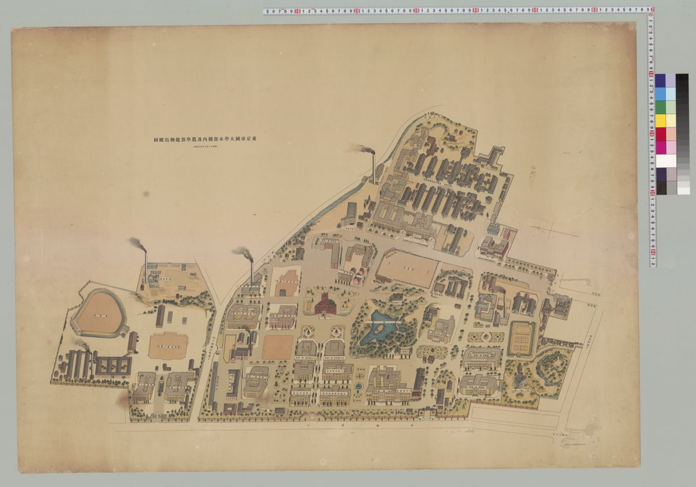
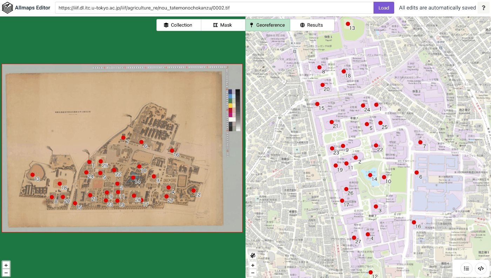

# IIIF Georeference to XYZ Tiles

IIIF Georeference Extension JSONからXYZタイルを生成し、MapLibre GL JSで表示するツール。


## 必要環境

- Python 3.x
- GDAL (`gdal_translate`, `gdalwarp`, `gdal2tiles.py`)

### GDALのインストール

```bash
# macOS (Homebrew)
brew install gdal

# Ubuntu/Debian
sudo apt install gdal-bin python3-gdal
```

## 使用方法

```bash
python3 scripts/iiif_georef_to_tiles.py <IIIF_GEOREF_JSON_URL>
```

### 例

```bash
python3 scripts/iiif_georef_to_tiles.py https://nakamura196.github.io/iiif_geo/canvas.json
```

### オプション

| オプション | デフォルト | 説明 |
|-----------|-----------|------|
| `--scale` | 0.25 | 画像の縮小率 |
| `--zoom` | 14-18 | タイルのズームレベル範囲 |
| `--output-dir` | docs | 出力ディレクトリ |
| `--name` | tiles | タイルフォルダ名 |
| `--work-dir` | work | 作業用ディレクトリ |
| `--keep-work` | - | 作業用ファイルを削除しない |

## 処理の流れ

```
IIIF Georeference JSON
        │
        ▼
┌───────────────────────┐
│ 1. JSONを取得         │
│    (URLからfetch)     │
└───────────────────────┘
        │
        ▼
┌───────────────────────┐
│ 2. 画像をダウンロード │
│    (IIIF Image API)   │
└───────────────────────┘
        │
        ▼
┌───────────────────────┐
│ 3. GCPを埋め込み      │
│    (gdal_translate)   │
└───────────────────────┘
        │
        ▼
┌───────────────────────┐
│ 4. 座標変換           │
│    (gdalwarp)         │
└───────────────────────┘
        │
        ▼
┌───────────────────────┐
│ 5. タイル生成         │
│    (gdal2tiles.py)    │
└───────────────────────┘
        │
        ▼
┌───────────────────────┐
│ 6. HTMLビューア生成   │
│    (MapLibre GL JS)   │
└───────────────────────┘
```

### 変換結果

| 元画像 | 地理参照後 |
|--------|-----------|
|  |  |

## 出力ファイル

```
docs/
├── index.html    # MapLibre GL JSビューア
├── source.json   # 元のIIIF Georeference JSON
└── tiles/        # XYZタイル
    ├── 14/
    ├── 15/
    ├── 16/
    ├── 17/
    └── 18/
```

## ローカルで確認

```bash
cd docs && python3 -m http.server 8000
# http://localhost:8000/ を開く
```

## IIIF Georeference Extension

IIIF Georeference Extensionは、IIIF画像に地理参照情報を付与するための拡張仕様です。



- [IIIF Georeference Extension Specification](https://iiif.io/api/extension/georef/)

### JSONの構造

```json
{
  "@context": [
    "http://iiif.io/api/extension/georef/1/context.json",
    "http://iiif.io/api/presentation/3/context.json"
  ],
  "type": "Canvas",
  "width": 18415,
  "height": 12911,
  "items": [...],
  "annotations": [
    {
      "type": "AnnotationPage",
      "items": [
        {
          "type": "Annotation",
          "motivation": "georeferencing",
          "body": {
            "type": "FeatureCollection",
            "transformation": {
              "type": "polynomial",
              "options": { "order": 1 }
            },
            "features": [
              {
                "type": "Feature",
                "properties": {
                  "resourceCoords": [6690, 7517]
                },
                "geometry": {
                  "type": "Point",
                  "coordinates": [139.7623182, 35.7151233]
                }
              }
            ]
          }
        }
      ]
    }
  ]
}
```

## サンプルデータの出典

デモで使用している画像は以下から取得しています：

- **東京帝國大學本部構内及農學部建物鳥瞰圖**
  - 出典: [東京大学デジタルアーカイブポータル](https://da.dl.itc.u-tokyo.ac.jp/portal/assets/187cc82d-11e6-9912-9dd4-b4cca9b10970)

## 参考

- [IIIF Presentation API 3.0](https://iiif.io/api/presentation/3.0/)
- [IIIF Image API 3.0](https://iiif.io/api/image/3.0/)
- [IIIF Georeference Extension](https://iiif.io/api/extension/georef/)
- [Allmaps](https://allmaps.org/) - IIIF画像の地理参照ツール
- [GDAL Documentation](https://gdal.org/)
- [MapLibre GL JS](https://maplibre.org/maplibre-gl-js/docs/)
